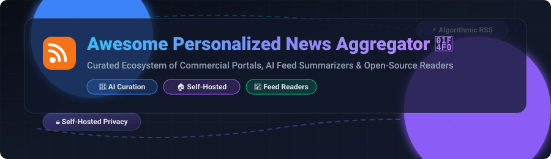

# 📰 Awesome Personalized News Aggregator

  

  
  
  
  
  

## 🚀 Top Personalized News Aggregator Ecosystem

> **Curated List of Commercial SaaS Portals, AI Feed Summarizers & Open-Source Self-Hosted RSS Readers**  
> *Focused on Algorithmic Curation, Feed Generation, Privacy-First Reading & Custom Source Management*  
> **Last updated: October 2026**

This repository tracks notable **commercial news aggregators**, **AI curation services**, and **open-source RSS projects** that personalize digital news consumption — ranging from machine-learning recommendation feeds and LLM story summaries to self-hosted RSS readers providing complete user control over source filtering, privacy, and ranking.

---

## 📌 Table of Contents

- [☁️ SaaS / Hosted Platforms](#%EF%B8%8F-saas--hosted-platforms)
- [💻 Open-Source GitHub Projects](#-open-source-github-projects)
- [🧠 AI-Powered Personalization & Summarizers](#-ai-powered-personalization--summarizers)
- [🤝 How to Contribute](#-how-to-contribute)
- [💖 Support & Sponsorship](#-support--sponsorship)
- [⚠️ Disclaimer](#%EF%B8%8F-disclaimer)
- [📈 Star History](#-star-history)

---

## ☁️ SaaS / Hosted Platforms

**Market Size & Sector Structure**: The global news aggregator market is estimated at **~$14.8 Billion to $15.0 Billion (2025/2026)** and is projected to reach **~$29.8 Billion by 2033** (CAGR ~9.1%). The sector is **moderately to highly fragmented**: mass-consumer news portals are dominated by big-tech giants, while niche content curation, power-user RSS reading, and AI feed summarization are distributed across specialized commercial platforms and self-hosted open-source tools.

| Product / Platform | Description & Key Features | Pricing (Starting Paid Tier) | Free Tier Limit | Company Size / Valuation / Revenue |
| :--- | :--- | :--- | :--- | :--- |
| **[Apple News](https://www.apple.com/apple-news/)** | Curated news combining human editors and algorithmic personalization. Apple News+ adds digital magazines and premium audio stories. | **$12.99/month** (Apple News+ standard individual subscription) | Free app with select article previews; 1-month free trial for Apple News+ (3 months with eligible new Apple device) | **~$3.84 Trillion - $4.98 Trillion** Market Cap *(Apple Inc.)* |
| **[Microsoft Start](https://www.msn.com/)** | Windows, Edge, and MSN-integrated content aggregator delivering personalized news, weather, and trending topics. | **Free** (Ad-supported, no paid premium tier) | Unlimited ad-supported web/mobile feed access (no custom RSS feed imports) | **~$3.84 Trillion** Market Cap *(Microsoft Corp.)* |
| **[Google News](https://news.google.com/)** | Algorithmic AI-powered news clustering, topic following, and local coverage spanning news publishers across 125+ countries. | **Free** (Ad-supported, no paid premium tier) | Unlimited ad-supported personalized feed access and search (no ad-free plan or feed import) | **~$2.10 Trillion - $2.50 Trillion** Market Cap *(Alphabet Inc.)* |
| **[SmartNews](https://www.smartnews.com/)** | Machine-learning news discovery platform focused on quality journalism, "Smart" channels, and local news delivery. | **Free** (Ad-supported, no paid premium tier) | Unlimited ad-supported article reading and offline channel browsing | **$2.0 Billion** Valuation (~$104.5M Annual Revenue; ~500 employees) |
| **[Flipboard](https://flipboard.com/)** | Magazine-style aggregation platform allowing users to curate custom digital "Magazines" from any Web/RSS source. | **Free** (Ad-supported, creator referral ad revenue sharing) | Unlimited magazine creation, curation, and reading with no reader paywalls | **$1.3 Billion** Valuation (~$34M - $71M Annual Revenue; ~150 employees) |
| **[NewsBreak](https://www.newsbreak.com/)** | AI-driven hyperlocal news aggregator connecting local content creators and publishers with U.S. community readers. | **Free** (Ad-supported, no paid premium tier) | Unlimited hyper-local news feed access and community contributor posts | **$1.0 Billion** Valuation (~$100M Annual Revenue; ~350 employees) |
| **[Pocket](https://getpocket.com/)** | Save-for-later article reader and discovery service (*Service officially shut down by Mozilla on July 8, 2025*). | **Discontinued** ($4.99/month or $44.99/year prior to July 2025 shutdown) | Service Shutdown (Export-only window concluded Nov 12, 2025; historically unlimited article saving) | **~$600 Million** Annual Revenue *(Mozilla Corp parent; acquired Pocket for ~$30M)* |
| **[Feedly](https://feedly.com/)** | Leading commercial RSS reader featuring AI assistant ("Leo") for feed deduplication, keyword filtering, and team boards. | **$6.00/month** (Billed annually at $72/yr for Pro tier; Pro+ with AI at $12.99/mo) | Up to 100 RSS sources across 3 folders max (no AI filtering, power search, or integrations) | **~$7 Million - $10 Million** ARR (Bootstrapped private company; ~60 employees) |
| **[Inoreader](https://www.inoreader.com/)** | Power-user RSS reader featuring automation rules, keyword monitoring, newsletter feeds, and WebSub push updates. | **$7.50/month** (Billed annually at $90/yr for Pro tier; $9.99/mo monthly) | Up to 150 RSS subscriptions, 20 newsletter feeds, and 20 web feeds (ad-supported) | **~$1 Million - $2 Million** ARR (Bootstrapped Innologica Ltd; ~10 employees) |

---

## 💻 Open-Source GitHub Projects

Below is a curated list of open-source RSS readers, feed generators, and self-hosted aggregators sorted by **GitHub Star Count** (descending order).

- **[RSSHub](https://github.com/DIYgod/RSSHub)**   
  **The leading open-source RSS feed generator** (MIT License). Generates RSS/Atom feeds for websites without native RSS support (Weibo, Bilibili, YouTube, Twitter/X, Telegram, and 1,000+ routes). Essential companion for any self-hosted RSS setup.

- **[Follow (Folo)](https://github.com/RSSNext/follow)**   
  **Next-generation AI-powered information browser & RSS reader** (GPL-3.0 License). Combines blogs, newsletters, and social feeds into a calm timeline with built-in LLM summarization, translation, and media aggregation.

- **[FreshRSS](https://github.com/FreshRSS/FreshRSS)**   
  **The leading self-hosted RSS aggregator** (AGPL-3.0 License). Features WebSub push, XPath scraping for non-RSS sites, OPML import/export, multi-user accounts, Docker deployment, and rich extension ecosystem. The canonical Google Reader replacement.

- **[NetNewsWire](https://github.com/Ranchero-Software/NetNewsWire)**   
  **Native RSS reader for macOS and iOS** (MIT License). Fast, clean, privacy-focused open-source feed reader supporting direct RSS parsing as well as syncing with Feedbin, Feedly, FreshRSS, and Inoreader.

- **[Miniflux](https://github.com/miniflux/v2)**   
  **Minimalist, opinionated RSS reader in Go** (Apache-2.0 License). Single binary backend with PostgreSQL database. Deliberately minimal, ultra-fast, and includes Fever & Google Reader API support for mobile app integration (Reeder, Unread).

- **[Fluent Reader](https://github.com/yang9999/fluent-reader)**   
  **Modern cross-platform desktop RSS reader** (BSD-3-Clause License). Built with Electron, React, and Fluent UI. Features local feed storage as well as cloud sync with Fever, Feedbin, Miniflux, and FreshRSS backends.

- **[RSS-Bridge](https://github.com/RSS-Bridge/rss-bridge)**   
  **PHP-based feed generation bridge** (Public Domain). Generates RSS/Atom feeds for websites that do not offer feeds out-of-the-box using 200+ built-in web scraping bridges.

- **[NewsBlur](https://github.com/samuelclay/NewsBlur)**   
  **Feature-complete open-source RSS reader with commercial hosting** (MIT License). Offers intelligence filtering (story training to highlight/hide articles), social sharing, and iOS/Android mobile apps.

- **[Yarr](https://github.com/nkanaev/yarr)**   
  **Lightweight web-based RSS reader in Go** (MIT License). Compiled into a single binary with embedded SQLite storage, making it ideal for Raspberry Pi and low-resource home servers.

- **[Stringer](https://github.com/stringer-rss/stringer)**   
  **Self-hosted anti-social RSS reader in Ruby** (MIT License). Lightweight, self-contained feed reader with zero external dependencies, designed for distraction-free reading.

- **[Feedbin](https://github.com/feedbin/feedbin)**   
  **Open-source web feed reader powering the commercial Feedbin service** (MIT License). Supports RSS, Atom, JSON Feed, Twitter timeline ingestion, and email newsletter subscriptions.

- **[CommaFeed](https://github.com/Athou/commafeed)**   
  **Google Reader clone built with Java & Angular** (Apache-2.0 License). Self-hosted RSS reader offering a classic Google Reader user experience with containerized Docker deployment.

- **[Selfoss](https://github.com/fossar/selfoss)**   
  **Multipurpose RSS reader & stream mashup aggregator** (GPL-3.0 License). PHP backend aggregating RSS, Atom, JSON, and live web scraping into a customizable stream layout.

- **[RSSMonster](https://github.com/pietheinstrengholt/rssmonster)**   
  **Modern web-based RSS reader built with Vue & Node.js** (MIT License). Features 3-pane responsive interface, smart folders, and full-text search capability.

- **[Leed](https://github.com/ldleman/Leed)**   
  **Lightweight PHP RSS aggregator** (GPL-3.0 License). Clean, fast, and mobile-friendly self-hosted feed aggregator with notification support and plugin extension hooks.

- **[Kriss Feed](https://github.com/tontof/kriss_feed)**   
  **Simple, database-optional PHP RSS reader** (GPL-3.0 License). Minimalist and ultra-fast, designed specifically for low-resource server environments.

- **[Goeland](https://github.com/slavsub/goeland)**   
  **CLI tool for RSS to email digest dispatch** (MIT License). Written in Go; automatically polls configured feeds and generates clean HTML email digests.

- **[Brief](https://github.com/shonebinu/Brief)**   
  **AI-powered RSS feed summarizer** (MIT License). Leverages Large Language Models to condense complex RSS feeds into readable executive summaries.

---

## 🧠 AI-Powered Personalization & Summarizers

- **[Follow (Folo)](https://github.com/RSSNext/follow)**: AI-first feed browser providing automated article summarization, key takeaway extraction, and language translation.
- **[Brief](https://github.com/shonebinu/Brief)**: Open-source LLM summarizer reducing information overload across large RSS feed collections.
- **[HackerNews AI](https://github.com/hackernews-ai/hackernews-ai)**: AI-driven Hacker News summarizer distilling top tech stories and comment threads.
- **[Feedly AI (Leo)](https://feedly.com/)**: Commercial AI engine for prioritizing high-impact news, filtering duplicate stories, and tracking market signals.

---

## 🤝 How to Contribute

Contributions are warmly welcomed! Help us keep this curated directory up-to-date and comprehensive.

1. 🍴 **Fork the repository** on GitHub.
2. 📝 **Add or edit entries in `README.md`** following the existing table or list formats.
3. ℹ️ **Provide accurate details**: Include project name, homepage link, star count badge, license, and a concise 1-2 sentence description.
4. 🚀 **Submit a Pull Request** with a clear explanation of your additions.

Please ensure all entries maintain a factual, objective tone and link directly to official repositories or product websites. Check out our curated meta-list at [Awesome-Awesome-Awesome](https://github.com/ishandutta2007/Awesome-Awesome-Awesome)!

---

## 💖 Support & Sponsorship

A huge thank you to everyone exploring, using, and contributing to this curated repository! If you find this resource helpful:

- ⭐ **Star this repository** to help others discover it!
- 🔀 **Fork and share** with fellow developers, homelabbers, and privacy-conscious readers.
- ☕ **Buy me a coffee**: Support the ongoing maintenance and curation of awesome developer tools via the [GitHub Sponsor Dashboard](https://github.com/sponsors/ishandutta2007).

---

## ⚠️ Disclaimer

- This directory is a **community-curated list** — presented for informational purposes without commercial endorsement.
- Proprietary news aggregators rely on opaque algorithms and editorial choices. **Self-hosted RSS readers provide complete user sovereignty** over source selection, ranking order, and data privacy.
- **RSSHub public instances may be subject to rate limits** — running a self-hosted instance is recommended for high reliability.
- **Google Reader's retirement in 2013** underscores the importance of open standards and open-source self-hosted solutions.

---

## 📈 Star History

